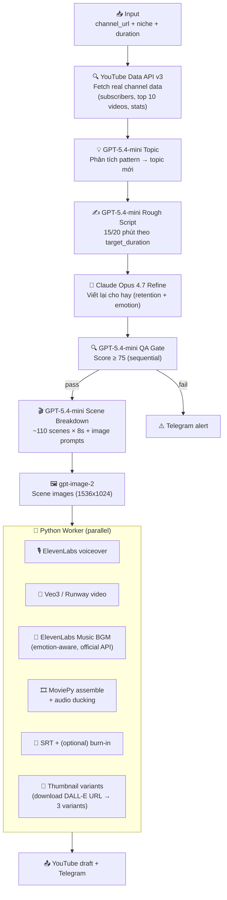

# AI YouTube Content Engine v3.0

**Phiên bản:** 3.0.0
**Mục tiêu:** Tự động hóa quy trình sản xuất video YouTube cho **bất kỳ niche nào**, dựa trên việc phân tích một kênh YouTube tham chiếu.
**Output:** Video `master_video.mp4` + thumbnail + subtitle + upload draft lên YouTube.

> Đầu vào: 1 URL kênh YouTube + niche + độ dài mong muốn.
> Đầu ra: video draft trên YouTube.

---

## 1. Luồng sản xuất



---

## 2. Đặc điểm chính

| Tính năng | Mô tả |
|---|---|
| **Channel-aware topic** | Phân tích kênh tham chiếu THẬT qua YouTube Data API, không bịa số liệu |
| **Multi-AI scriptwriting** | GPT viết kịch bản thô → Claude refine để tối ưu retention |
| **Sequential QA gate** | Tự chấm điểm 0-100, fail-fast nếu < `MIN_QA_SCORE` (chạy TRƯỚC scene breakdown để không tốn tiền DALL-E khi script bị reject) |
| **Emotion-aware BGM** | ElevenLabs Music generate nhạc instrumental khớp `core_emotion` của topic (melancholic / tense / uplifting...) — official API |
| **Adaptive BGM duration** | BGM tự gen đúng độ dài video (cap 10min API), loop với crossfade nếu cần |
| **3-layer audio mix** | Voice 100% + Veo3 native ambient/SFX 30% + BGM 15% — KHÔNG vứt Veo3 native audio như trước |
| **Image-to-video continuity** | DALL-E image → Veo 3.1 initial frame → visual giữa scene image và video clip khớp nhau |
| **Subtitle dual-mode** | `.srt` cho YouTube CC, hoặc burn-in (ffmpeg) cho TikTok/Shorts |
| **Cost guard** | Pre-check budget, abort nếu estimate vượt `BUDGET_LIMIT_PER_VIDEO` |
| **Generic niche** | Đổi 4 dòng env → sản xuất nội dung niche khác, không sửa code |

---

## 3. Stack công nghệ

- **Orchestration:** n8n (Docker)
- **AI Text:** OpenAI GPT-5.4-mini + Anthropic Claude Opus 4.7
- **AI Image:** OpenAI `gpt-image-2` (size `1536x1024`)
- **AI Video:** Google Veo 3.1 (default) hoặc Runway Gen-4 Turbo
- **AI Voice:** ElevenLabs (`eleven_multilingual_v2`)
- **AI Music:** ElevenLabs Music (`music_v1`) — **official API** (Suno deprecated vì không có public API)
- **YouTube data:** YouTube Data API v3
- **Render:** MoviePy + FFmpeg (Python worker)
- **DB:** PostgreSQL 15
- **Notifications:** Telegram Bot API
- **Deploy:** Docker Compose

---

## 4. Cài đặt

### 4.1 Quick start
```bash
git clone <repo-url>
cd dog-psychology-engine
cp .env.example .env
nano .env                          # Điền API keys
docker compose up -d --build
```

### 4.2 Setup n8n
1. Mở `http://localhost:5678` → tạo admin
2. Credentials → New → Postgres (Name: `Postgres`, Host: `postgres`, DB/user/pass theo `.env`)
3. Workflows → Import từ `n8n_workflows/` (3 file: 01, 02, 03)
4. Activate từng workflow

**Hướng dẫn deploy chi tiết: [`dog-psychology-engine/deploy.md`](./dog-psychology-engine/deploy.md)**

---

## 5. Test chạy

```bash
curl -X POST http://localhost:5678/webhook/start-pipeline \
  -H "Content-Type: application/json" \
  -d '{
    "channel_url": "https://www.youtube.com/@MrBeast",
    "channel_niche": "viral entertainment",
    "language": "English",
    "target_duration_minutes": 15
  }'
```

Theo dõi:
```bash
docker compose logs -f python_worker
curl http://localhost:8000/api/v1/status/<episode_id>
```

Output:
- `assets_temp/final_output/master_video_<id>.mp4`
- `assets_temp/final_output/subtitles_<id>.srt`
- `assets_temp/final_output/thumbnails_<id>/variant_*.jpg`
- Telegram: `✅ RENDER COMPLETE`

---

## 6. Cấu hình niche

Đổi 4 dòng trong `.env` để chuyển sản xuất sang niche khác:

```env
CHANNEL_NAME=My Channel
CHANNEL_NICHE=cooking                  # bất kỳ niche nào
CHANNEL_URL=https://www.youtube.com/@reference_channel
TARGET_DURATION_MINUTES=20
```

---

## 7. Cấu trúc repository

```text
.
├── Readme.md                                    # ← Bạn đang đọc
└── dog-psychology-engine/
    ├── deploy.md                                # Hướng dẫn triển khai chi tiết
    ├── README.md                                # README inner (kỹ thuật)
    ├── docker-compose.yml
    ├── init.sql                                 # PostgreSQL schema
    ├── .env.example
    ├── n8n_workflows/                           # 3 workflow JSON
    │   ├── 01_idea_and_script.json              # Pipeline chính
    │   ├── 02_scene_generation.json             # Manual entry với script sẵn
    │   ├── 03_render_and_upload.json            # Webhook callback từ worker
    │   └── reference_full_pipeline.json         # Legacy — bỏ qua
    ├── prompts_library/                         # Templates (optional)
    └── worker/                                  # FastAPI Python service
        ├── main_server.py                       # API /api/v1/render + pipeline orchestration
        ├── video_assembler.py                   # MoviePy ghép + ffmpeg burn-in subs
        ├── asset_downloader.py                  # ElevenLabs voiceover + Veo3/Runway video
        ├── elevenlabs_music.py                  # BGM official (default provider)
        ├── suno_client.py                       # BGM via Suno (legacy/optional, unofficial)
        ├── thumbnail_gen.py                     # Pillow text overlay (3 variants)
        ├── tiktok_cutter.py                     # 9:16 crop + hardsub cho Shorts
        ├── veo3_generator.py                    # Google Veo 3.1 video gen
        ├── distributor.py                       # YouTube upload + Telegram
        ├── clean_temp.py                        # Cleanup sau upload
        └── Dockerfile
```

> ⚠️ Tên thư mục `dog-psychology-engine/` chỉ là legacy từ project gốc. Engine giờ là generic, không gắn niche cụ thể. Có thể rename sau nếu muốn.

---

## 8. Chi phí ước tính

Video 15 phút (~110 scenes × 8s):

| Service | Cost |
|---|---|
| GPT-5.4-mini (topic + script + QA + scenes + SEO) | ~$1 |
| Claude Opus 4.7 (script refine) | ~$0.5 |
| `gpt-image-2` (~110 scene images + 1 thumbnail) | ~$2-5 |
| ElevenLabs voiceover (~2500 từ) | ~$1 |
| Veo 3.1 hoặc Runway Gen-4 Turbo (~110 × 8s) | ~$5-50 |
| ElevenLabs Music (BGM ~120s instrumental) | ~$0.3 |
| **Total / video** | **~$10-60** |

> Veo3 rẻ hơn Runway ~10×. Set `VIDEO_PROVIDER=veo3` để tiết kiệm.
> ElevenLabs Music yêu cầu paid plan ($22/tháng Creator) — set `MUSIC_PROVIDER=static` nếu chỉ test.

---

## 9. Lộ trình triển khai

| Tuần | Mục tiêu |
|---|---|
| **1** | Setup Docker, lấy API keys, OAuth YouTube, chạy thành công 1 video draft đầu tiên |
| **2** | Test phân tích các kênh tham chiếu khác nhau, tinh chỉnh QA score, tối ưu prompt template |
| **3** | Bật scheduled trigger, monitor cost, xử lý các edge case (Veo3 timeout, ElevenLabs quota) |
| **4** | A/B test thumbnail, tối ưu retention dựa trên YouTube Analytics, kích hoạt TikTok burn-in |

---

## 10. Error handling

- **API timeout / 5xx:** Auto-retry 3 lần (worker `urllib3.Retry`)
- **Rate limit 429:** Retry với `Retry-After` header
- **Budget exceeded:** Worker abort + Telegram alert
- **QA score < threshold:** Workflow throw error, không vào phase render
- **Worker crash:** PostgreSQL giữ scene state, chạy lại workflow sẽ resume scenes failed
- **YouTube refresh token expired:** Worker log lỗi, video vẫn được render local

---

## 11. API keys cần đăng ký (4 service tối thiểu)

| Key env | Service | Dùng để |
|---|---|---|
| `OPENAI_API_KEY` | OpenAI | Topic + script + image (DALL-E) + scene breakdown + SEO + QA |
| `ANTHROPIC_API_KEY` | Anthropic | Claude refine script |
| `ELEVENLABS_API_KEY` + `ELEVENLABS_VOICE_ID` | ElevenLabs | Voice + Music (1 key dùng cả 2!) |
| `GOOGLE_API_KEY` + `YOUTUBE_DATA_API_KEY` | Google AI Studio | Veo3 video + YouTube channel analysis (có thể dùng cùng 1 key) |

Optional:
- `YOUTUBE_CLIENT_ID/SECRET/REFRESH_TOKEN` — auto-upload draft lên YouTube
- `TELEGRAM_BOT_TOKEN/CHAT_ID` — push notification
- `VIDEO_API_KEY` — chỉ cần nếu set `VIDEO_PROVIDER=runway`

**Hướng dẫn lấy từng key: xem [`dog-psychology-engine/deploy.md`](./dog-psychology-engine/deploy.md#3-lấy-api-keys) section 3.**

---

## 12. Giới hạn đã biết

Xem [`dog-psychology-engine/deploy.md`](./dog-psychology-engine/deploy.md#10-giới-hạn-đã-biết-sẽ-cải-tiến) section 10:
- Thumbnail từ DALL-E đã download local (3 variants) nhưng chưa auto-upload lên YouTube qua `youtube.thumbnails().set()` API
- TikTok highlights chưa auto-extract từ script (workflow không tạo `highlights[]` trong manifest)
- Character consistency giữa scenes (DALL-E mỗi scene độc lập, không có character DNA)
- Chưa có frame chaining giữa scene N và N+1
- ElevenLabs Music yêu cầu paid plan; nếu không có → fallback static BGM
- **Không có UI cho end-user** — chỉ trigger qua n8n UI hoặc curl webhook

---

## 13. License

Internal project.
