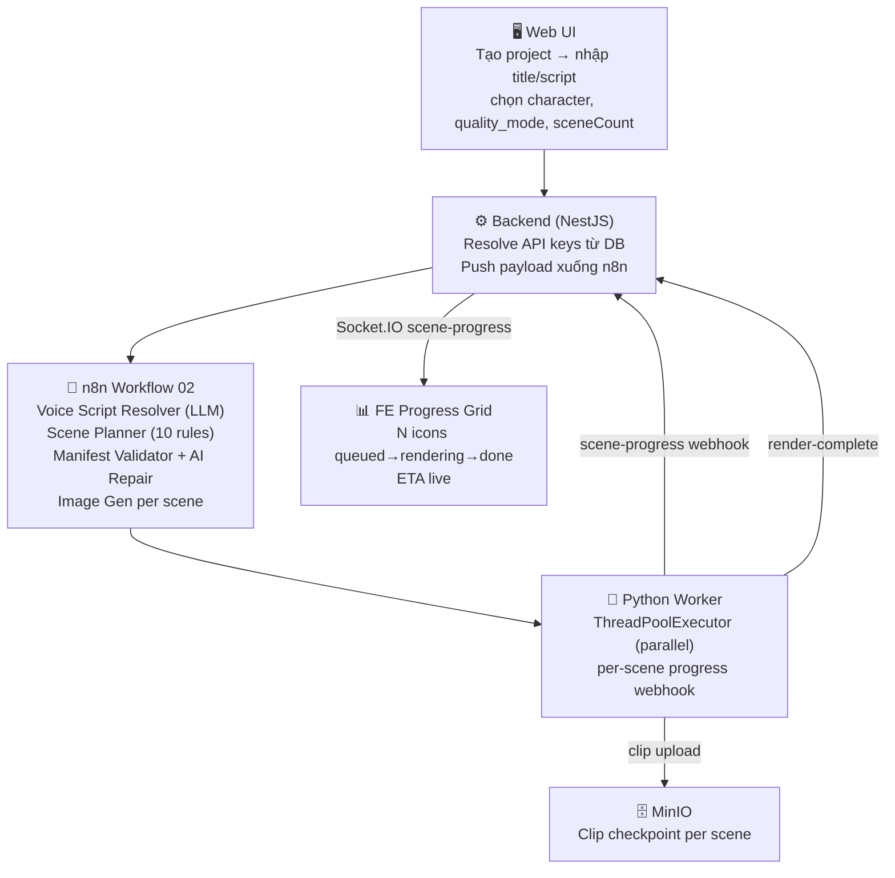

# AI YouTube Content Engine v5.2

**Phiên bản:** 5.2.0
**Mục tiêu:** Tự động hóa quy trình sản xuất video YouTube — provider-agnostic, character DNA, quality tiers.
**Output:** Video `master.mp4` + thumbnail + per-scene clips lưu trên MinIO.

---

## 1. Luồng sản xuất



---

## 2. Tính năng chính

| Tính năng | Mô tả |
|---|---|
| **Provider-agnostic routing** | Script/Image/Video provider chọn per-project qua UI, không hardcode. BE resolve key + URL động |
| **Character library** | Tạo nhân vật có `name + description`. Generate ảnh nhân vật bằng Gemini → inject làm DNA vào prompt image gen |
| **Character DNA** | Scene có `has_character=true` → image prompt + character_bible + ảnh nhân vật (multimodal ref) → visual consistency |
| **Quality mode** | `draft` (≤3 scenes, $0.12) / `standard` (≤5, $0.20) / `premium` (≤8, $0.32) — cap sceneCount tự động |
| **Voice script resolver** | Nhập lời thoại sẵn → clean nhẹ; để trống → LLM sinh từ title + style |
| **AI Scene Planner (10 rules)** | Narration verbatim, sentence boundaries, word balance ±20%, exact scene count |
| **Manifest validator + AI repair** | Validate output JSON (similarity, fields, count) → repair 1x nếu lỗi nhẹ → fail-fast nếu nặng |
| **Veo3 video gen** | `VIDEO_PROVIDER=veo3` → Vertex AI Veo 3.1, image-to-video mode; retry transient → Ken Burns fallback |
| **Ken Burns fallback** | Veo3 fail permanent/transient → ffmpeg zoompan slideshow, pipeline không bao giờ stuck |
| **Gemini session (free)** | `gemini_session` → tạo video bằng tài khoản Gemini Pro/Ultra (cookie phiên qua app login), không tốn API key. Lựa chọn song song Veo3, chọn per-project. Xem §4.4 |
| **Semaphore Veo3** | Max 3 concurrent Veo call (override `MAX_CONCURRENT_VEO`) |
| **Scene checkpoint** | Mỗi scene done → upload clip lên MinIO ngay, không mất nếu worker crash |
| **Cost guard** | BE pre-flight estimate vs `BUDGET_LIMIT_PER_VIDEO`; FE badge đỏ + confirm dialog nếu > $3 |
| **Per-scene progress grid** | N ô realtime: queued (xám) → rendering (violet spinner) → done (emerald) → failed (rose) |
| **ETA** | `avg_wall_clock / doneCount × remaining` — hiển thị header, cập nhật mỗi giây |
| **Clip preview** | Click ô done → modal `<video autoPlay>` xem clip scene đó |

---

## 3. Stack công nghệ

| Layer | Công nghệ |
|---|---|
| **Orchestration** | n8n (Docker), workflow tự import + activate lần đầu |
| **Backend** | NestJS + Prisma + PostgreSQL 15 |
| **Frontend** | Next.js 14 (App Router) + TailwindCSS + Socket.IO client |
| **Realtime** | Socket.IO gateway `/jobs`, room `video:{videoId}` |
| **AI Script** | Google Gemini Flash (default) hoặc Anthropic Claude (PRE-1) |
| **AI Image** | Google Gemini Flash Image (Gemini multimodal, query-auth) |
| **AI Video** | Veo 3.1 via Vertex AI SDK (Veo3) hoặc ffmpeg Ken Burns (slideshow) |
| **Storage** | MinIO (S3-compatible) — clips, images, master video, thumbnails |
| **Queue** | BullMQ (Redis) cho background jobs |
| **Notifications** | Telegram Bot API |

---

## 4. Cài đặt

### 4.1 Quick start

```bash
git clone <repo-url>
cd Gen_video_Content_Automation_with_AI
cp .env.example .env
docker compose up -d --build
```

8 container khởi động: `postgres`, `redis`, `minio`, `n8n`, `n8n_init`, `backend`, `frontend`, `python_worker`.

| URL | Mục đích |
|---|---|
| http://localhost:3000 | **Web UI** — toàn bộ thao tác |
| http://localhost:5678 | n8n admin (workflows tự import, chỉ vào khi cần debug) |
| http://localhost:9001 | MinIO console (xem file sinh ra) |

### 4.2 Cấu hình lần đầu (qua UI)

1. **Tạo project** tại http://localhost:3000 → đặt tên, chọn provider mặc định
2. **Thêm API key** tại http://localhost:3000/api-sources → paste key → hệ thống auto-detect provider+capability → Lưu (mã hoá AES-256-GCM)
3. **(Optional) Tạo character** tại tab Characters → nhập tên + mô tả → Generate ảnh (cần Google IMAGE quota)
4. **Tạo video** → chọn quality mode, sceneCount, character (tuỳ chọn), nhập/để trống voice script → Submit

Pipeline tự chạy, UI hiện grid per-scene realtime.

### 4.3 Setup Veo3 (tuỳ chọn)

Veo3 cần GCP credentials ngoài Google AI Studio key:

```bash
# 1. Bật billing GCP + enable Vertex AI API
# 2. Tạo Service Account role aiplatform.user → download key
cp your-sa-key.json secrets/gcp-sa.json

# 3. Đổi provider trong .env
echo "VIDEO_PROVIDER=veo3" >> .env
docker compose up -d python_worker
```

Nếu không có Veo3, mặc định `VIDEO_PROVIDER=slideshow` (Ken Burns ffmpeg, miễn phí).

### 4.4 Dùng tài khoản Gemini Pro/Ultra thay API key (`gemini_session`)

Tạo video bằng gói subscription Gemini Pro/Ultra — **không tốn API key trả phí**. Là một **lựa chọn song song** với Veo3 (không thay thế), chọn per-project qua dropdown "Sinh video" → **"Tài khoản Gemini (Pro/Ultra)"**.

**Kết nối tài khoản** (app login chạy trên máy người dùng, KHÔNG trong Docker):

```bash
# Dev: chạy trực tiếp
pip install playwright          # dùng Chrome đã cài → khỏi tải chromium
cd video-content-engine/worker
python gemini_login.py          # mở cửa sổ → đăng nhập Google → tự gửi cookie về backend

# Đóng gói cho người dùng cuối (1 file .exe, bấm đúp):
pip install pyinstaller playwright
pyinstaller --onefile --collect-all playwright gemini_login.py   # → dist/gemini_login.exe
```

Login xong → `/api-sources` hiện **"Đã kết nối"**. Cookie lưu mã hoá trong DB; worker đọc runtime, hết hạn thì render fallback về slideshow → đăng nhập lại để refresh. Đổi `BACKEND_URL` nếu backend không ở `http://localhost:3001`.

> ⚠️ **Giới hạn quan trọng (browser automation login):**
> - **Google có thể chặn đăng nhập** trong cửa sổ automation (báo *"This browser or app may not be secure"*). App đã thêm stealth (ẩn cờ `--enable-automation`, `navigator.webdriver`) nhưng **KHÔNG đảm bảo** qua được. Nếu bị chặn: dùng **profile Chrome đã đăng nhập sẵn** (đóng hết Chrome rồi cho app đọc cookie), hoặc **dán cookie** `__Secure-1PSID` / `__Secure-1PSIDTS` thủ công.
> - **ToS:** tự động hoá phiên web có thể vi phạm điều khoản Google → **rủi ro khoá tài khoản**. Nên dùng **tài khoản phụ**.
> - **Cap subscription:** gói có giới hạn ngày (vd Ultra ~5 video/ngày) → video nhiều scene có thể bị giới hạn; khi đó cân nhắc Veo3 API.

---

## 5. API keys cần có

| Key | Service | Bắt buộc |
|---|---|---|
| Google AI Studio `AIza...` | Gemini script + Gemini image | **Có** (script). Image cần quota riêng |
| `secrets/gcp-sa.json` | Vertex AI (Veo3) | Không (dùng slideshow nếu thiếu) |
| Anthropic `sk-ant-...` | Claude script (thay Gemini) | Không |
| ElevenLabs | Voiceover | Không (pipeline chạy không có voice) |
| Telegram Bot | Notifications | Không |

Key thêm qua UI `/api-sources`, không lưu trong `.env`.

---

## 6. Chi phí ước tính

Với `VIDEO_PROVIDER=slideshow` (không cần Veo3):

| Quality | Scenes | Script (Gemini) | Image (Gemini) | Video (ffmpeg) | Total |
|---|---|---|---|---|---|
| Draft | 3 | ~$0.01 | ~$0.09 | $0 | **~$0.10** |
| Standard | 5 | ~$0.02 | ~$0.15 | $0 | **~$0.17** |
| Premium | 8 | ~$0.03 | ~$0.24 | $0 | **~$0.27** |

Với `VIDEO_PROVIDER=veo3` (thêm ~$0.59/scene):

| Quality | Scenes | Tổng |
|---|---|---|
| Draft | 3 | **~$1.80** |
| Standard | 5 | **~$3.00** |
| Premium | 8 | **~$4.80** |

> Budget limit mặc định `BUDGET_LIMIT_PER_VIDEO=$5.00` — BE block nếu vượt. Override bằng env.

---

## 7. Cấu trúc repository

```text
.
├── Readme.md
├── CHECKLIST.md                        # Task tracking v5.2
├── backend/src/
│   ├── common/provider-registry.ts     # Provider → {url, auth, format} map
│   ├── modules/source/source.service.ts # createManual: resolve providers + push n8n
│   ├── gateways/jobs.gateway.ts        # Socket.IO: scene-progress, job events
│   └── webhooks/worker.controller.ts   # Webhook từ python_worker
├── frontend/src/components/video/
│   └── PipelineProgress.tsx            # Per-scene grid + ETA + clip modal
├── video-content-engine/
│   ├── n8n_workflows/
│   │   ├── 02_scene_generation.json    # Scene planner + validator + image gen
│   │   └── 03_render_and_upload.json   # Render callback
│   └── worker/
│       ├── main_server.py              # Orchestration + scene-progress webhook
│       ├── asset_downloader.py         # Image/video download + Veo3 + Ken Burns
│       ├── veo3_generator.py           # Vertex AI Veo 3.1 SDK wrapper
│       └── Dockerfile
└── secrets/
    └── gcp-sa.json                     # GCP Service Account key (gitignored)
```

---

## 8. Trạng thái tính năng

| Tính năng | Trạng thái | Ghi chú |
|---|---|---|
| Provider-agnostic routing | ✅ Done | Gemini script + image hoạt động |
| Character library + DNA | ✅ Done | Image gen cần Google IMAGE quota |
| Quality mode + cost guard | ✅ Done | Draft/Standard/Premium |
| Voice script + scene planner | ✅ Done | 10 rules, narration verbatim |
| Manifest validator + repair | ✅ Done | AI repair 1x |
| Veo3 video gen | ✅ Code done | Cần PRE-2/3/4 (GCP billing + SA key) |
| Ken Burns fallback | ✅ Done | Veo3 fail → slideshow tự động |
| Per-scene progress grid | ✅ Done | Realtime via Socket.IO |
| ETA + clip preview modal | ✅ Done | |
| Character image gen | ⏳ Pending quota | Google IMAGE quota 429 |
| E2E smoke test | ⏳ Pending quota | Blocked cùng blocker image |

---

## 9. License

Internal project.
