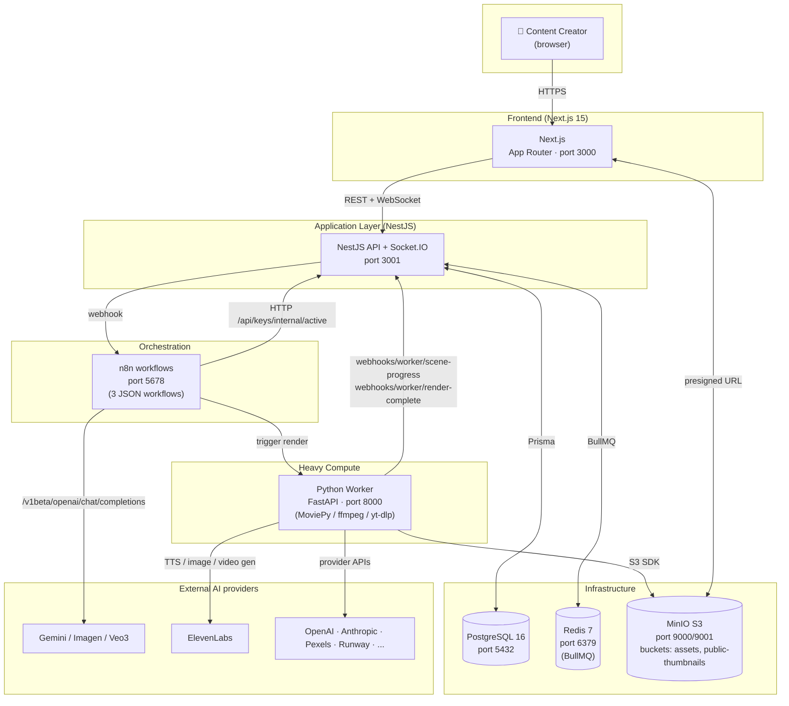

# 02 — Architecture

## Container diagram (C4-lite)

## Phân chia trách nhiệm

| Service | Trách nhiệm chính | KHÔNG được làm |
|---|---|---|
| **Frontend** | UI, form validation, draft persistence, realtime hiển thị qua Socket.IO | Gọi trực tiếp Python worker, lưu API key cleartext |
| **Backend (NestJS)** | REST API, AuthN/Z, BullMQ producer, Prisma data access, webhook gateway, encrypt/decrypt API keys (AES-256-GCM), Socket.IO hub, Telegram notification | Render video, fetch transcript YouTube (delegate cho worker) |
| **n8n** | Orchestrate luồng AI tổng hợp script + scene breakdown + thumbnail generation. **Stateless** giữa các workflow | Lưu state lâu dài (đẩy về DB qua BE), lưu API key (lấy từ BE qua `/api-keys/internal/active`) |
| **Python Worker** | Asset generation (image/video/audio), MinIO upload/download, video assembly (ffmpeg/MoviePy), YouTube transcript fetch, Veo3/Imagen/ElevenLabs SDK calls | Persist data trực tiếp Postgres (luôn callback BE) |
| **PostgreSQL** | Source of truth cho mọi entity: Project, Video, Scene, ApiKey, Job, Source, ... | Lưu blob/file (dùng MinIO) |
| **Redis (BullMQ)** | Job queue: `render`, `transcript-fetch`, `notify` | Cache lâu dài (chỉ ephemeral) |
| **MinIO** | Asset storage S3-compat: ảnh, video, audio, thumbnail | Metadata (về DB) |

## Stack chi tiết

| Layer | Công nghệ | Version |
|---|---|---|
| FE framework | Next.js | 15 (App Router) |
| FE state | TanStack Query | v5 |
| FE styling | Tailwind CSS + shadcn/ui | latest |
| FE realtime | socket.io-client | v4 |
| BE framework | NestJS | latest |
| BE ORM | Prisma | latest |
| BE queue | BullMQ (Node) | latest |
| BE realtime | Socket.IO server | v4 |
| Orchestration | n8n | 2.x |
| Worker framework | FastAPI | latest |
| Worker video lib | MoviePy + ffmpeg | latest |
| Database | PostgreSQL | 16 |
| Cache/Queue | Redis | 7 |
| Object storage | MinIO | latest |

## Webhook contracts

Tất cả webhook đều có HMAC header tuỳ chọn (`X-Signature: sha256=...`, shared secret env `WEBHOOK_HMAC_SECRET`). Hiện tại enforcement đang `optional` để không block dev local.

| Endpoint | Caller | Purpose |
|---|---|---|
| `POST /webhooks/n8n/render-request` | n8n (cuối workflow 02) | Yêu cầu BE enqueue render job |
| `POST /webhooks/n8n/script-complete` | n8n (workflow 01) | Báo BE script đã sinh xong |
| `POST /webhooks/n8n/pipeline-error` | n8n | Báo lỗi pipeline |
| `POST /webhooks/worker/scene-progress` | Python worker | Cập nhật tiến độ từng scene (BE re-emit Socket.IO) |
| `POST /webhooks/worker/render-complete` | Python worker | Render xong (success/fail), BE update DB + Telegram + Socket.IO |
| `POST /webhooks/worker/notify` | Python worker | Gửi notification (Telegram) |

## Tham khảo

- [05-pipeline.md](05-pipeline.md) — sequence diagram đầy đủ luồng tạo video
- [03-data.md](03-data.md) — ERD và relations
- [docker-compose.yml](../docker-compose.yml) — definition các service + env
