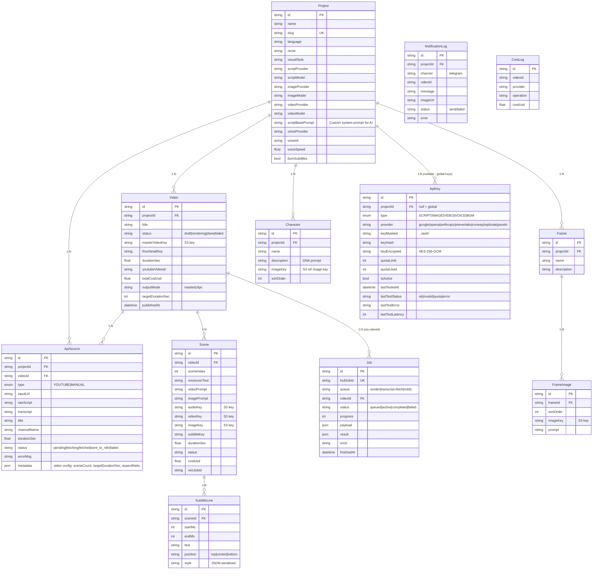

# 03 — Data Model

Schema gốc: [backend/prisma/schema.prisma](../backend/prisma/schema.prisma). 13 models + 2 enums. PostgreSQL 16.

## ERD



## Bảng tham chiếu nhanh

| Model | Bảng SQL | Cardinality lớn nhất | Indexes chính |
|---|---|---|---|
| `Project` | `Project` | dev: 1-10 | `slug` (unique) |
| `Video` | `videos` (mapped) | dev: 1-1000 | `(projectId)`, `(status)` |
| `Scene` | `scenes` (mapped) | ~10-20 per video | `(videoId)` |
| `SubtitleLine` | `SubtitleLine` | nhiều / scene | `(sceneId)` |
| `Frame` | `Frame` | per project | `(projectId)` |
| `FrameImage` | `FrameImage` | per frame | `(frameId)` |
| `Character` | `Character` | per project | `(projectId)` |
| `ApiKey` | `ApiKey` | 1-30 | `(projectId, type)`, `(provider, isActive)` |
| `ApiSource` | `ApiSource` | 1 per video creation | `(projectId)`, `(inputUrl)` |
| `Job` | `Job` | grows fast (truncate cũ) | `(videoId)`, `(queue, status)`, `(createdAt)` |
| `NotificationLog` | `NotificationLog` | grows | `(projectId)`, `(createdAt)` |
| `CostLog` | `cost_log` (mapped) | grows per scene | `(videoId)` |

## Enum

```prisma
enum ApiKeyType { SCRIPT  IMAGE  VIDEO  VOICE  BGM }
enum SourceType { YOUTUBE  MANUAL }
```

## Notes về thiết kế

- **`Video.masterVideoKey` và các `*Key` field**: lưu **S3 key**, không phải URL (URL có TTL → presign khi cần)
- **`ApiKey.keyEncrypted`**: AES-256-GCM, key derive từ env `ENCRYPTION_SECRET`. `keyHash` dùng cho dedup
- **`ApiKey.projectId == null`**: key global, tất cả project xài chung
- **`Job.videoId` nullable**: không phải job nào cũng gắn video (vd: `transcript-fetch` ban đầu chỉ có sourceId)
- **`Project.scriptBasePrompt`**: tuỳ chọn — null = dùng director template hardcoded trong n8n; có giá trị = override system prompt
- **`Video.outputMode`**: legacy enum cho per-scene clips mode (hiện default `master` luôn — clips là side-effect)
- **Soft delete**: không dùng. Cascade delete cho mọi relation child

## Migrations history

```
backend/prisma/migrations/
├── 0_init
├── 1_add_voice_and_modules
├── 2_add_model_config
├── 3_add_script_base_prompt
└── 4_add_apikey_test_status
```

Mỗi migration tự apply khi backend container khởi động (`npx prisma migrate deploy` trong CMD).
