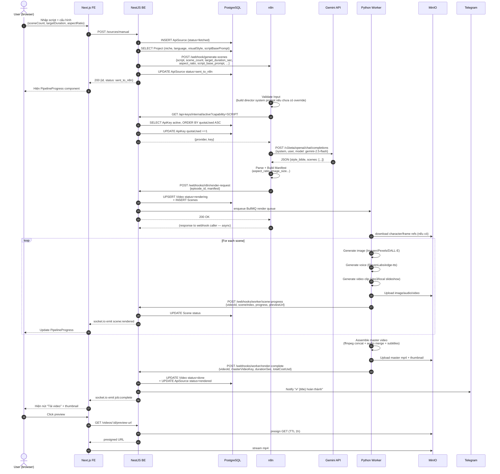

# 05 — Pipeline Flow

Luồng E2E tạo 1 video từ script tự nhập (manual). Luồng YouTube tương tự nhưng có thêm bước fetch transcript ở đầu.

## Sequence diagram — Manual flow



## Các giai đoạn (stages)

| Stage | Actor | Output | Timeout / SLA |
|---|---|---|---|
| 1. Submit | FE → BE | `ApiSource` row | <1s |
| 2. AI scene breakdown | n8n + Gemini | JSON manifest scenes | 10-30s |
| 3. Build manifest + thumbnail | n8n | manifest payload | 5-10s |
| 4. Render request | n8n → BE → BullMQ | Job queued | <1s |
| 5. Per-scene asset generation | Python worker | Image + voice + video clip per scene | 30s-5min/scene (paid Veo3 ~10min) |
| 6. Master assembly | Python worker (ffmpeg) | Master mp4 + thumbnail | 1-3min |
| 7. Callback + notify | BE → Telegram + Socket.IO | Status update | <1s |

**Auto-fail timeout:** [source.service.ts `markStaleAsFailed`](../backend/src/modules/source/source.service.ts) đánh dấu source `failed` nếu kẹt > 15 phút ở `sent_to_n8n / queued / fetching`.

## YouTube flow (khác biệt)

```
FE submit URL
  → BE POST /sources/youtube
  → BE INSERT ApiSource (type=YOUTUBE)
  → BE enqueue BullMQ transcript-fetch
  → Python worker (transcript-fetch consumer):
     - yt-dlp lấy transcript hoặc auto-caption
     - lưu transcript vào ApiSource.transcript
     - gọi BE để trigger n8n workflow 02 với transcript đó
  → từ đây nhập luồng manual (bước 2 trở đi)
```

## Failure modes phổ biến

| Triệu chứng | Nguyên nhân | Hành động |
|---|---|---|
| `sent_to_n8n` ≥ 15 phút | n8n workflow chưa active hoặc Gemini chậm | Reimport workflow + check `Quotation` |
| n8n "Get Script API Key" 404 | Chưa có SCRIPT API key active trong DB | Vào `/api-sources` thêm/bật key Google/OpenAI |
| Gemini 400 `API_KEY_INVALID` | Key đã expired/revoked | Test key qua nút `Test` trên `/api-sources`, regenerate ở provider |
| Worker treo / không callback | Veo3 timeout, ElevenLabs quota | Xem `docker logs vca_python_worker` |
| Webhook BE 404 | n8n URL trỏ sai (`python_worker:8000` cũ) | Sửa workflow 01/02 → `http://backend:3001/api/v1/webhooks/n8n/*` |

## Liên quan

- [02-architecture.md](02-architecture.md) — phân chia trách nhiệm
- [04-api.md](04-api.md) — chi tiết các webhook endpoint
- [06-deployment.md](06-deployment.md) — vận hành + troubleshooting
- [video-content-engine/n8n_workflows/](../video-content-engine/n8n_workflows/) — workflow JSON
