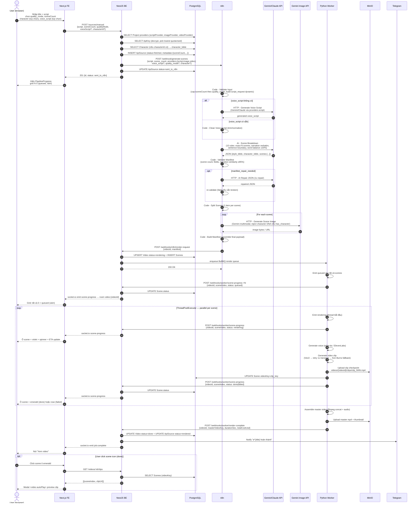

# 05 — Pipeline Flow v5.2

Luồng E2E tạo 1 video từ script tự nhập (manual). Luồng YouTube tương tự nhưng có thêm bước fetch transcript ở đầu.

## Sequence diagram — Manual flow



---

## Các giai đoạn (stages)

| Stage | Actor | Output | Timeout / SLA |
|---|---|---|---|
| 1. Submit + provider resolve | FE → BE | `ApiSource` row, providers resolved | <1s |
| 2. Voice script resolver | n8n + LLM | voice_script (generated hoặc cleaned) | 5-15s (nếu AI sinh) |
| 3. AI Scene Breakdown | n8n + LLM | JSON manifest (N scenes, narration verbatim) | 10-30s |
| 4. Manifest validate + repair | n8n | Validated manifest hoặc AI-repaired | 0-20s (repair chỉ khi cần) |
| 5. Image gen per scene | n8n + Gemini Image | Scene images + thumbnail | 5-10s/ảnh |
| 6. Render request | n8n → BE → BullMQ | Job queued, DB scenes inserted | <1s |
| 7. Per-scene video gen | Python worker (parallel) | Clip per scene + MinIO checkpoint | 30s-10min/scene |
| 8. Master assembly | Python worker (ffmpeg) | master.mp4 | 1-3min |
| 9. Callback + notify | BE → Telegram + Socket.IO | Status update | <1s |

**Parallel:** Bước 7 chạy song song với `ThreadPoolExecutor`, tối đa `MAX_CONCURRENT_VEO=3` cho Veo3.

**Auto-fail timeout:** [source.service.ts `markStaleAsFailed`](../backend/src/modules/source/source.service.ts) đánh dấu source `failed` nếu kẹt > 15 phút ở `sent_to_n8n / queued / fetching`.

---

## YouTube flow (khác biệt)

```
FE submit URL
  → BE POST /sources/youtube
  → BE INSERT ApiSource (type=YOUTUBE)
  → BE enqueue BullMQ transcript-fetch
  → Python worker (transcript-fetch consumer):
     - yt-dlp lấy transcript hoặc auto-caption
     - lưu transcript vào ApiSource.transcript
     - gọi BE để trigger n8n workflow 02 với transcript đó
  → từ đây nhập luồng manual (bước 2 trở đi)
```

---

## Failure modes phổ biến

| Triệu chứng | Nguyên nhân | Hành động |
|---|---|---|
| `sent_to_n8n` ≥ 15 phút | n8n workflow chưa active hoặc LLM chậm | Reimport workflow (`docker compose run n8n_init`) + check n8n execution log |
| n8n "providers.script is null" | Chưa có SCRIPT API key active trong DB cho provider đã chọn | Vào `/api-sources` thêm/bật key Google hoặc Anthropic |
| Image gen 429 | Google IMAGE quota hết | Chờ quota reset hoặc dùng key khác |
| Manifest validator fatal | AI trả JSON sai (scene count lệch >2, narration <70% match) | Xem n8n execution log → thường do model thay đổi format; thử lại |
| Scene grid không xuất hiện | `source.metadata.sceneCount` null | Kiểm tra BE log, `sceneCount` phải có trong `videoConfig` khi submit |
| Worker treo / không callback | Veo3 timeout, không có key | Xem `docker logs vca_python_worker`; `VIDEO_PROVIDER=slideshow` để dùng Ken Burns fallback |
| Clip modal hiện "Đang tải" mãi | Scene clip chưa upload MinIO (`videoKey` null) | Worker có thể fail ở bước upload; xem log |
| Webhook BE 404 | n8n URL trỏ sai | Sửa workflow → `http://backend:3001/api/v1/webhooks/n8n/*` |

---

## Liên quan

- [02-architecture.md](02-architecture.md) — phân chia trách nhiệm
- [04-api.md](04-api.md) — chi tiết các webhook endpoint
- [06-deployment.md](06-deployment.md) — vận hành + troubleshooting
- [video-content-engine/n8n_workflows/](../video-content-engine/n8n_workflows/) — workflow JSON
